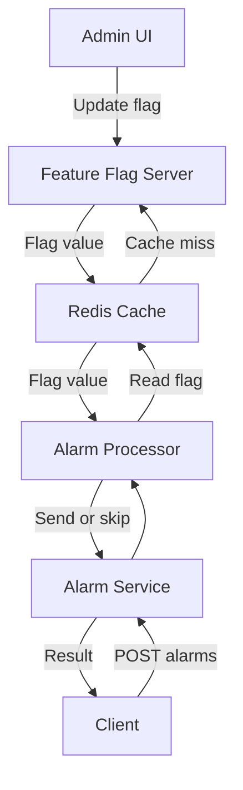
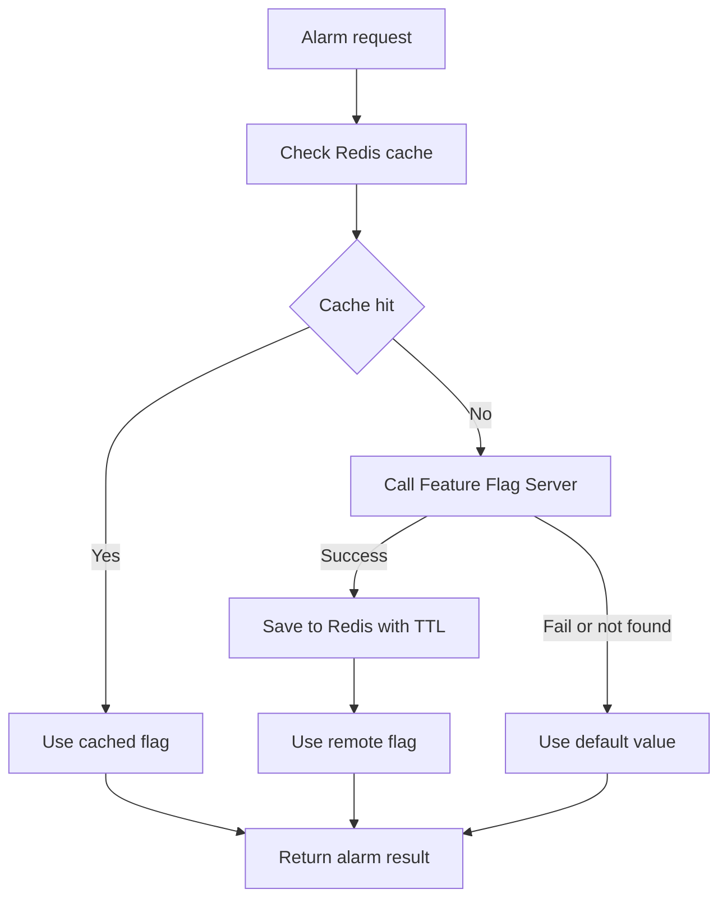

# Feature Flag Playground

Kotlin + Spring Boot로 feature flag 패턴을 실습하기 위한 멀티 모듈 프로젝트입니다.

이 프로젝트의 목적은 본 서비스가 배포 없이 외부 feature flag 설정을 읽어서 런타임 동작을 바꾸는 구조를 간단한 코드로 실습하기 위함입니다.  
(예제 도메인은 알림 발송 서비스입니다.)

## 목적

feature flag를 단순한 `if` 문이 아니라, 운영 중 설정 변경으로 서비스 흐름을 바꾸는 패턴으로 연습합니다.

예를 들어 다음 상황을 실습할 수 있습니다.

- SMS 알림 발송을 배포 없이 끄기
- 특정 사용자에게만 신규 알림 템플릿 적용하기
- 초당 처리량 제한 값을 운영 중 바꾸기
- flag 서버 값을 매번 조회하는 대신 Redis TTL 캐시로 부하 줄이기
- flag 변경 후 TTL 만료 전/후로 본 서비스 동작이 달라지는 모습 확인하기

## 모듈 구성

```text
feature-flag-playground
├── feature-flag-server
│   ├── flag 등록/조회/수정 REST API
│   ├── 간단한 관리자 HTML 화면
│   └── in-memory flag 저장소
├── alarm-service
│   ├── 알림 발송 요청 API
│   ├── Redis TTL 캐시 기반 FeatureFlagClient
│   └── flag 값에 따른 알림 처리 분기
└── docker-compose.yml
    └── Redis
```

## 시스템 흐름



## 런타임 flag 조회 흐름

`alarm-service`는 알림 요청을 처리할 때마다 `FeatureFlagClient`를 호출합니다. 단, 매번 바로 `feature-flag-server`를 호출하지 않고 Redis를 먼저 봅니다.



flag 서버 장애, Redis 장애, flag 미존재 같은 상황에서는 요청자가 넘긴 기본값을 사용하고 `source=DEFAULT`로 응답합니다.

## 제공되는 flag

| Key | Type | 기본 값 | 동작 |
| --- | --- | --- | --- |
| `alarm.sms.enabled` | `BOOLEAN` | `true` | `false`이면 SMS 알림을 보내지 않고 `SKIPPED` 처리 |
| `alarm.rate-limit-per-second` | `NUMBER` | `5` | 초당 처리 가능한 알림 요청 수 |
| `alarm.new-template.target-users` | `STRING_LIST` | 빈 값 | 포함된 userId는 신규 템플릿으로 메시지 렌더링 |

## 동작이 바뀌는 예시

### 1. SMS 발송 ON/OFF

`alarm.sms.enabled=true`이면 SMS 알림 요청은 정상 발송 처리됩니다.

```json
{
  "status": "SENT",
  "renderedMessage": "hello"
}
```

관리자 화면이나 API로 `alarm.sms.enabled=false`로 바꾸면, TTL 만료 후 같은 요청이 스킵됩니다.

```json
{
  "status": "SKIPPED",
  "reason": "SMS_DISABLED_BY_FEATURE_FLAG"
}
```

중요한 점은 Redis TTL입니다. 기본 TTL이 5초라서 flag를 바꾼 직후에는 `alarm-service`가 아직 캐시된 이전 값을 사용할 수 있습니다.

### 2. 신규 템플릿 대상 사용자

`alarm.new-template.target-users=user-1,user-2`로 설정하면 해당 유저에게만 신규 템플릿이 적용됩니다.

```json
{
  "userId": "user-1",
  "renderedMessage": "[NEW] hello"
}
```

목록에 없는 사용자는 기존 메시지를 그대로 받습니다.

```json
{
  "userId": "user-3",
  "renderedMessage": "hello"
}
```

### 3. 처리량 제한

`alarm.rate-limit-per-second=1`로 설정하면 같은 초 안에서 첫 요청만 처리되고, 이후 요청은 제한됩니다.

```json
{
  "status": "RATE_LIMITED",
  "reason": "RATE_LIMIT_EXCEEDED"
}
```

## 실행 방법

### 1. Redis 실행

Docker가 실행 중이라면:

```bash
docker compose up -d redis
```

로컬에 Redis가 설치되어 있다면 대신 다음처럼 실행해도 됩니다.

```bash
redis-server --port 6379 --save "" --appendonly no
```

### 2. feature flag 서버 실행

```bash
./gradlew :feature-flag-server:bootRun
```

- API: `http://localhost:8081/api/flags`
- 관리자 화면: `http://localhost:8081/`

### 3. 알림 서비스 실행

```bash
./gradlew :alarm-service:bootRun
```

- API: `http://localhost:8080/alarms`

## API 사용 예시

### 알림 요청

```bash
curl -s -X POST http://localhost:8080/alarms \
  -H 'Content-Type: application/json' \
  -d '{"userId":"user-1","channel":"SMS","message":"hello"}'
```

응답 예시:

```json
{
  "status": "SENT",
  "channel": "SMS",
  "userId": "user-1",
  "renderedMessage": "hello",
  "reason": null,
  "usedFlags": [
    {
      "key": "alarm.sms.enabled",
      "source": "REMOTE",
      "value": true
    },
    {
      "key": "alarm.rate-limit-per-second",
      "source": "REMOTE",
      "value": 5
    },
    {
      "key": "alarm.new-template.target-users",
      "source": "REMOTE",
      "value": []
    }
  ]
}
```

`usedFlags[].source`를 보면 flag 값을 어디서 읽었는지 확인할 수 있습니다.

- `REMOTE`: Redis에 값이 없어 `feature-flag-server`에서 읽음
- `CACHE`: Redis TTL 캐시에서 읽음
- `DEFAULT`: Redis/remote 조회 실패 또는 값 파싱 실패로 기본값 사용

### flag 값 수정

```bash
curl -s -X PUT http://localhost:8081/api/flags/alarm.sms.enabled \
  -H 'Content-Type: application/json' \
  -d '{"value":"false"}'
```

### TTL 캐시 확인

1. Redis를 비웁니다.

```bash
redis-cli flushall
```

2. 알림 요청을 보냅니다. 첫 요청은 `source=REMOTE`가 됩니다.

```bash
curl -s -X POST http://localhost:8080/alarms \
  -H 'Content-Type: application/json' \
  -d '{"userId":"user-1","channel":"SMS","message":"hello"}'
```

3. 5초 안에 같은 요청을 다시 보내면 `source=CACHE`가 됩니다.

4. `alarm.sms.enabled=false`로 바꿉니다.

```bash
curl -s -X PUT http://localhost:8081/api/flags/alarm.sms.enabled \
  -H 'Content-Type: application/json' \
  -d '{"value":"false"}'
```

5. TTL 만료 전에는 기존 캐시 때문에 아직 `SENT`일 수 있습니다.

6. 5초 뒤 다시 요청하면 `SKIPPED`로 바뀝니다.

## 테스트

```bash
./gradlew test
```

테스트는 크게 두 범위를 확인합니다.

- `feature-flag-server`
  - flag 타입 검증
  - flag 목록/단건 조회/생성/수정 API

- `alarm-service`
  - cache hit이면 remote API를 호출하지 않음
  - cache miss이면 remote API 호출 후 Redis TTL 캐싱
  - remote 실패 시 기본값 사용
  - SMS OFF, 신규 템플릿 대상자, rate limit 처리

## 현재 단순화한 부분

실습 프로젝트라 일부러 작게 만들었습니다.

- feature flag 저장소는 인메모리입니다.
- 관리자 화면 인증은 없습니다.
- 실제 SMS/Push/Email 연동은 하지 않고 발송 결과만 시뮬레이션합니다.
- percentage rollout, 복잡한 조건식, 환경별 flag 관리는 없습니다.

이후 확장한다면 percentage rollout, 사용자 그룹 조건, 마지막 성공값 fallback, DB 저장소, 감사 로그 같은 기능을 붙여볼 수 있습니다.
